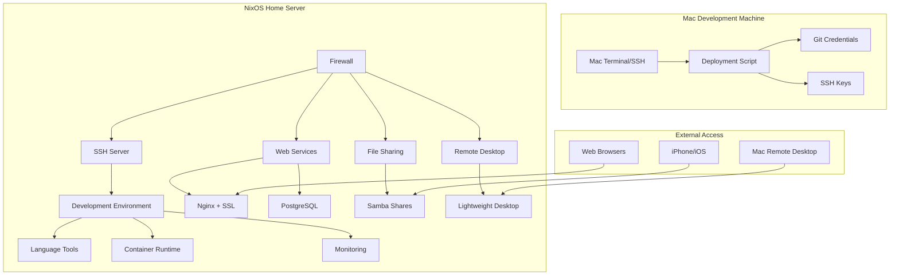

# Design Document

## Overview

This design outlines a comprehensive NixOS configuration for a development-focused home server that provides both server functionality and a complete development environment. The system will be optimized for remote access from macOS devices while maintaining security best practices and providing a robust development platform.

## Architecture

### System Architecture



### Network Architecture

- **Firewall**: Enabled with selective port opening
- **SSH**: Port 22 (local network only)
- **HTTP/HTTPS**: Ports 80/443 for web services
- **Samba**: Ports 139/445 for file sharing
- **Remote Desktop**: Port 5900 for VNC access
- **PostgreSQL**: Port 5432 (localhost only)

## Components and Interfaces

### 1. Core System Configuration

**Flake Structure:**
```
flake.nix                 # Main flake configuration
├── nixos/
│   ├── configuration.nix # Main system configuration
│   ├── hardware.nix      # Hardware-specific settings
│   ├── networking.nix    # Network and firewall configuration
│   ├── services/         # Service-specific modules
│   │   ├── web.nix       # Nginx + SSL configuration
│   │   ├── database.nix  # PostgreSQL configuration
│   │   ├── samba.nix     # File sharing configuration
│   │   ├── desktop.nix   # Remote desktop configuration
│   │   └── monitoring.nix # Logging and monitoring
│   └── users.nix         # User account configuration
├── home-manager/
│   └── home.nix          # User environment configuration
├── scripts/
│   ├── deploy.sh         # Mac deployment script
│   └── setup-ssh.sh     # SSH key setup script
└── README.md             # Comprehensive setup guide
```

### 2. Development Environment

**Language Support:**
- **TypeScript/Node.js**: Latest LTS Node.js, npm, yarn, TypeScript compiler
- **Java**: OpenJDK 21, Maven, Gradle
- **C++**: GCC, Clang, CMake, Make
- **Rust**: Rustc, Cargo, Rust analyzer
- **Python**: Python 3.12, pip, poetry, virtual environment tools

**Development Tools:**
- **Editors**: Neovim with LSP support, VS Code server
- **Version Control**: Git with credential helper
- **Containers**: Docker and Podman with compose support
- **Shell**: Zsh with Oh My Zsh, syntax highlighting, autocompletion

**Modern Sysadmin CLI Tools:**
- **System Monitoring**: htop, btop, glances, iotop, nethogs
- **File Operations**: exa (ls replacement), bat (cat replacement), fd (find replacement), ripgrep (grep replacement)
- **Network Tools**: nmap, netstat, ss, tcpdump, wireshark-cli, curl, httpie
- **Process Management**: pgrep, pkill, systemctl, journalctl
- **Disk Management**: ncdu (disk usage), duf (df replacement), lsblk, smartctl
- **Text Processing**: jq (JSON processor), yq (YAML processor), sed, awk
- **Performance Analysis**: perf, strace, lsof, vmstat, iostat
- **Security Tools**: fail2ban, lynis, rkhunter, chkrootkit
- **Backup & Sync**: rsync, rclone, borgbackup, restic
- **Container Tools**: dive (Docker image analysis), ctop (container monitoring)

### 3. Remote Access Solution

**Desktop Environment Choice: XFCE**
- Lightweight and stable for remote access
- Better compatibility with macOS RDP clients than KDE
- Lower resource usage compared to GNOME
- Proven track record for remote desktop scenarios

**Remote Desktop Protocol: VNC**
- VNC protocol provides reliable cross-platform remote desktop access
- x11vnc allows sharing of existing X11 session for seamless experience
- Better compatibility with various VNC clients on macOS (built-in Screen Sharing, VNC Viewer)
- More stable connection handling compared to XRDP for XFCE desktop environment

### 4. Web Services Stack

**Nginx Configuration:**
- Reverse proxy capabilities for future services
- SSL/TLS termination with automatic certificate management
- Security headers and best practices
- Static file serving for web development

**SSL Certificate Management:**
- ACME client for Let's Encrypt certificates
- Certbot integration for certificate renewal
- Automatic renewal via systemd timers
- Support for both HTTP-01 and DNS-01 challenges

**PostgreSQL Setup:**
- Latest stable PostgreSQL version
- Local-only access (no network exposure)
- Development databases pre-configured
- Backup automation included

### 5. File Sharing Configuration

**Samba Setup:**
- SMB3 protocol for iOS compatibility
- User-based authentication with strong passwords
- Single non-critical shared directory (`/srv/public-share`) exposed to internet
- Separate local-only shares for sensitive data
- Network discovery via Avahi/mDNS
- Rate limiting and connection limits for internet access
- Time Machine support for Mac backups (optional)

### 6. Security Configuration

**Firewall Rules:**
```
Port 22   (SSH)     - Local network only
Port 80   (HTTP)    - All interfaces (redirect to HTTPS)
Port 443  (HTTPS)   - All interfaces
Port 139  (NetBIOS) - All interfaces (for Samba)
Port 445  (SMB)     - All interfaces (for Samba)
Port 5900 (VNC)     - Local network only
```

**SSH Security:**
- Key-based authentication only
- Password authentication disabled
- Root login disabled
- Fail2ban for brute force protection

### 7. Backup Strategy

**Configuration Backup:**
- Git repository for all configuration files
- Automatic commits on system changes
- Remote backup to GitHub repository

**Data Backup Options:**
1. **Primary**: Rsync to Mac folder over SSH
2. **Alternative**: Rclone to iCloud Drive (if feasible)
3. **Local**: Automated snapshots using Btrfs or ZFS

### 8. Monitoring and Logging

**System Monitoring:**
- Prometheus for metrics collection
- Grafana for visualization dashboards
- Node Exporter for system metrics
- Custom dashboards for development metrics

**Log Management:**
- Systemd journal with persistent storage
- Log rotation and retention policies
- Centralized logging for all services
- Easy log analysis tools (journalctl, grep, etc.)

**Health Checks:**
- Service status monitoring
- Disk space alerts
- Memory usage monitoring
- Network connectivity checks

## Data Models

### User Configuration
```nix
{
  users.users.murali = {
    isNormalUser = true;
    extraGroups = [ "wheel" "docker" "networkmanager" ];
    shell = pkgs.zsh;
    openssh.authorizedKeys.keys = [
      # Mac SSH public key
    ];
  };
}
```

### Service Configuration
```nix
{
  services = {
    nginx.enable = true;
    postgresql.enable = true;
    samba.enable = true;
    openssh.enable = true;
  };
  
  # VNC remote desktop via x11vnc
  systemd.services.x11vnc.enable = true;
}
```

### Development Environment
```nix
{
  environment.systemPackages = with pkgs; [
    # Development tools
    nodejs_20 typescript
    openjdk21 maven gradle
    gcc clang cmake
    rustc cargo
    python312 poetry
    
    # Containers
    docker docker-compose
    podman podman-compose
    
    # Shell and utilities
    zsh oh-my-zsh
    git gh
    neovim
  ];
}
```

## Error Handling

### Deployment Error Handling
- Pre-deployment configuration validation
- Automatic rollback on failed deployments
- Health checks after deployment
- Detailed error logging and reporting

### Service Recovery
- Systemd service restart policies
- Automatic service recovery on failure
- Health check endpoints for critical services
- Graceful degradation for non-critical services

### Backup Recovery
- Point-in-time recovery for databases
- Configuration rollback capabilities
- Data restoration procedures
- Emergency recovery documentation

## Testing Strategy

### Configuration Testing
- NixOS configuration syntax validation
- Service startup testing in VM environment
- Network connectivity testing
- Security configuration verification

### Integration Testing
- Remote desktop connection testing from macOS
- File sharing access from iPhone
- Web service functionality testing
- Database connectivity testing

### Performance Testing
- Remote desktop responsiveness
- File transfer performance
- Web service response times
- System resource utilization

### Security Testing
- Firewall rule validation
- SSH key authentication testing
- SSL certificate validation
- Service isolation verification

## Deployment Process

### Initial Setup
1. **Hardware Preparation**: Install NixOS on target hardware
2. **Network Configuration**: Set static IP and hostname
3. **SSH Setup**: Configure initial SSH access
4. **Repository Clone**: Clone configuration from GitHub
5. **Key Exchange**: Set up passwordless SSH from Mac
6. **System Build**: Apply NixOS configuration
7. **Service Verification**: Test all services and remote access

### Ongoing Deployment
1. **Configuration Changes**: Modify configuration files on Mac
2. **Git Operations**: Commit and push changes to GitHub
3. **Deployment Script**: Run automated deployment script
4. **Remote Build**: Trigger nixos-rebuild on remote system
5. **Verification**: Confirm services are running correctly
6. **Rollback**: Automatic rollback if deployment fails

### Monitoring and Maintenance
1. **Regular Updates**: Automated system updates
2. **Backup Verification**: Regular backup integrity checks
3. **Performance Monitoring**: Continuous system monitoring
4. **Security Updates**: Automated security patch application