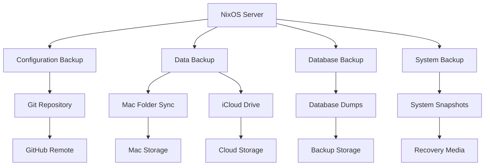

# Backup and Recovery Procedures

This document outlines comprehensive backup strategies and recovery procedures for the NixOS home server configuration.

## Backup Strategy Overview

The backup system implements a multi-layered approach:

1. **Configuration Backup**: Git-based versioning of system configuration
2. **Data Backup**: Automated backup of user data and application data
3. **Database Backup**: Point-in-time recovery for PostgreSQL databases
4. **System State Backup**: Complete system snapshots for disaster recovery

## Backup Architecture



## Configuration Backup

### Automated Git Backup

The system automatically commits configuration changes:

```bash
# Configuration backup service
systemd.services.config-backup = {
  description = "Backup system configuration to Git";
  after = [ "network.target" ];
  
  serviceConfig = {
    Type = "oneshot";
    User = "root";
    ExecStart = "${pkgs.bash}/bin/bash /etc/nixos/scripts/backup-config.sh";
  };
};

# Timer for regular backups
systemd.timers.config-backup = {
  description = "Run configuration backup daily";
  wantedBy = [ "timers.target" ];
  
  timerConfig = {
    OnCalendar = "daily";
    Persistent = true;
  };
};
```

### Manual Configuration Backup

```bash
# Backup current configuration
cd /etc/nixos
git add .
git commit -m "Backup configuration - $(date)"
git push origin main

# Create configuration archive
tar -czf nixos-config-$(date +%Y%m%d).tar.gz /etc/nixos/

# Verify backup integrity
git log --oneline -10
git status
```

### Configuration Recovery

```bash
# Restore from Git repository
cd /etc/nixos
git pull origin main

# Restore specific version
git checkout <commit-hash>
sudo nixos-rebuild switch --flake .

# Restore from archive
tar -xzf nixos-config-20240120.tar.gz -C /etc/nixos/
sudo nixos-rebuild switch --flake .
```

## Data Backup

### Primary Backup: Mac Folder Sync

The primary backup method syncs data to a Mac folder via SSH:

```bash
# Backup service configuration
systemd.services.backup-to-mac = {
  description = "Backup data to Mac folder";
  after = [ "network.target" ];
  
  serviceConfig = {
    Type = "oneshot";
    User = "backup";
    ExecStart = "${pkgs.rsync}/bin/rsync -av --delete /home/ mac-user@mac-ip:/backup/nixos/";
  };
};

# Daily backup timer
systemd.timers.backup-to-mac = {
  description = "Daily backup to Mac";
  wantedBy = [ "timers.target" ];
  
  timerConfig = {
    OnCalendar = "02:00";
    Persistent = true;
  };
};
```

### Alternative Backup: iCloud Drive

Secondary backup using rclone to iCloud Drive:

```bash
# Configure rclone for iCloud
rclone config create icloud webdav \
  url https://contacts.icloud.com \
  vendor other \
  user your-apple-id \
  pass your-app-password

# Backup to iCloud
systemd.services.backup-to-icloud = {
  description = "Backup data to iCloud Drive";
  
  serviceConfig = {
    Type = "oneshot";
    User = "backup";
    ExecStart = "${pkgs.rclone}/bin/rclone sync /home/ icloud:/nixos-backup/";
  };
};
```

### Backup Verification

```bash
# Check backup service status
systemctl status backup-to-mac.service
systemctl status backup-to-icloud.service

# View backup logs
journalctl -u backup-to-mac.service --since "24 hours ago"

# Verify backup integrity
ssh mac-user@mac-ip "ls -la /backup/nixos/"
rclone ls icloud:/nixos-backup/

# Test restore capability
rsync -av --dry-run mac-user@mac-ip:/backup/nixos/test-file ./
```

### Manual Data Backup

```bash
# Backup specific directories
rsync -av /home/user/projects/ mac-user@mac-ip:/backup/nixos/projects/
rsync -av /srv/public-share/ mac-user@mac-ip:/backup/nixos/shares/

# Create compressed backup
tar -czf data-backup-$(date +%Y%m%d).tar.gz /home/ /srv/

# Backup to external drive
rsync -av /home/ /mnt/external-drive/nixos-backup/
```

## Database Backup

### PostgreSQL Backup Configuration

```bash
# Database backup service
systemd.services.postgres-backup = {
  description = "Backup PostgreSQL databases";
  after = [ "postgresql.service" ];
  
  serviceConfig = {
    Type = "oneshot";
    User = "postgres";
    ExecStart = "${pkgs.postgresql}/bin/pg_dumpall -f /backup/postgres/backup-$(date +%Y%m%d).sql";
  };
};

# Backup timer
systemd.timers.postgres-backup = {
  description = "Daily PostgreSQL backup";
  wantedBy = [ "timers.target" ];
  
  timerConfig = {
    OnCalendar = "01:00";
    Persistent = true;
  };
};
```

### Manual Database Backup

```bash
# Backup all databases
sudo -u postgres pg_dumpall > postgres-backup-$(date +%Y%m%d).sql

# Backup specific database
sudo -u postgres pg_dump database_name > database-backup-$(date +%Y%m%d).sql

# Backup with compression
sudo -u postgres pg_dump -Fc database_name > database-backup-$(date +%Y%m%d).dump

# Verify backup
sudo -u postgres pg_restore --list database-backup.dump
```

### Database Recovery

```bash
# Restore all databases
sudo -u postgres psql -f postgres-backup-20240120.sql

# Restore specific database
sudo -u postgres createdb restored_database
sudo -u postgres psql restored_database < database-backup-20240120.sql

# Restore from compressed backup
sudo -u postgres pg_restore -d database_name database-backup.dump

# Point-in-time recovery
sudo -u postgres pg_basebackup -D /backup/postgres/base -Ft -z -P
```

## System State Backup

### NixOS Generation Management

```bash
# List system generations
sudo nix-env --list-generations --profile /nix/var/nix/profiles/system

# Create manual generation
sudo nixos-rebuild switch --flake .

# Keep specific number of generations
sudo nix-collect-garbage --delete-older-than 30d

# Backup generation profiles
cp -r /nix/var/nix/profiles/ /backup/nix-profiles/
```

### Complete System Backup

```bash
# Create system image
dd if=/dev/sda of=/backup/system-image-$(date +%Y%m%d).img bs=4M status=progress

# Compress system image
gzip /backup/system-image-$(date +%Y%m%d).img

# Backup critical system directories
tar -czf system-backup-$(date +%Y%m%d).tar.gz \
  /etc/ /var/ /home/ /srv/ \
  --exclude=/var/cache/ \
  --exclude=/var/tmp/
```

## Recovery Procedures

### Configuration Recovery

#### Scenario 1: Minor Configuration Issues

```bash
# Rollback to previous generation
sudo nixos-rebuild switch --rollback

# Or rollback to specific generation
sudo nixos-rebuild switch --switch-generation 42

# Verify system functionality
systemctl status --failed
```

#### Scenario 2: Major Configuration Corruption

```bash
# Boot from NixOS installation media
# Mount the system
mount /dev/sda1 /mnt
mount /dev/sda2 /mnt/boot  # if separate boot partition

# Enter the system
nixos-enter --root /mnt

# Restore configuration from Git
cd /mnt/etc/nixos
git reset --hard HEAD~1
nixos-rebuild switch --flake .

# Or restore from backup
rm -rf /mnt/etc/nixos/*
tar -xzf /backup/nixos-config-20240120.tar.gz -C /mnt/etc/nixos/
nixos-rebuild switch --flake . --root /mnt
```

### Data Recovery

#### Restore User Data

```bash
# Restore from Mac backup
rsync -av mac-user@mac-ip:/backup/nixos/home/ /home/

# Restore from iCloud backup
rclone sync icloud:/nixos-backup/home/ /home/

# Restore specific files
rsync -av mac-user@mac-ip:/backup/nixos/home/user/documents/ /home/user/documents/

# Verify restored data
ls -la /home/user/
diff -r /home/user/original/ /home/user/restored/
```

#### Restore Shared Files

```bash
# Restore Samba shares
rsync -av mac-user@mac-ip:/backup/nixos/shares/ /srv/public-share/

# Set correct permissions
chown -R nobody:nogroup /srv/public-share/
chmod -R 755 /srv/public-share/

# Restart Samba service
systemctl restart smbd nmbd
```

### Database Recovery

#### PostgreSQL Recovery

```bash
# Stop PostgreSQL service
systemctl stop postgresql

# Restore from backup
sudo -u postgres psql -f /backup/postgres/backup-20240120.sql

# Or restore specific database
sudo -u postgres dropdb database_name
sudo -u postgres createdb database_name
sudo -u postgres psql database_name < /backup/database-backup-20240120.sql

# Start PostgreSQL service
systemctl start postgresql

# Verify database integrity
sudo -u postgres psql -c "SELECT version();"
sudo -u postgres psql -c "\l"
```

### Complete System Recovery

#### Disaster Recovery from System Image

```bash
# Boot from NixOS installation media
# Identify target disk
lsblk

# Restore system image
gunzip -c /backup/system-image-20240120.img.gz | dd of=/dev/sda bs=4M status=progress

# Resize filesystem if needed
resize2fs /dev/sda1

# Update hardware configuration
nixos-generate-config --root /mnt

# Reboot into restored system
reboot
```

#### Recovery from System Backup Archive

```bash
# Boot from NixOS installation media
# Partition and format disk
parted /dev/sda mklabel gpt
parted /dev/sda mkpart primary 1MiB 100%
mkfs.ext4 /dev/sda1

# Mount and restore
mount /dev/sda1 /mnt
tar -xzf /backup/system-backup-20240120.tar.gz -C /mnt/

# Install bootloader
nixos-install --root /mnt

# Reboot
reboot
```

## Backup Monitoring and Maintenance

### Backup Health Monitoring

```bash
# Check backup service status
systemctl status backup-to-mac.timer
systemctl status postgres-backup.timer

# Monitor backup logs
journalctl -u backup-to-mac.service --since "7 days ago"

# Verify backup completeness
./scripts/verify-backups.sh

# Check backup storage usage
df -h /backup/
ssh mac-user@mac-ip "df -h /backup/"
```

### Backup Maintenance Tasks

```bash
# Clean old backups (keep last 30 days)
find /backup/ -name "*.sql" -mtime +30 -delete
find /backup/ -name "*.tar.gz" -mtime +30 -delete

# Rotate database backups
ls -t /backup/postgres/*.sql | tail -n +8 | xargs rm

# Compress old backups
find /backup/ -name "*.sql" -mtime +7 -exec gzip {} \;

# Verify backup integrity
for backup in /backup/*.tar.gz; do
  tar -tzf "$backup" > /dev/null && echo "$backup: OK" || echo "$backup: CORRUPTED"
done
```

### Automated Backup Testing

```bash
# Test restore procedure monthly
systemd.services.backup-test = {
  description = "Test backup restore procedure";
  
  serviceConfig = {
    Type = "oneshot";
    ExecStart = "${pkgs.bash}/bin/bash /scripts/test-restore.sh";
  };
};

systemd.timers.backup-test = {
  description = "Monthly backup test";
  wantedBy = [ "timers.target" ];
  
  timerConfig = {
    OnCalendar = "monthly";
    Persistent = true;
  };
};
```

## Backup Security

### Encryption

```bash
# Encrypt backups before transfer
gpg --symmetric --cipher-algo AES256 backup-file.tar.gz

# Decrypt for restore
gpg --decrypt backup-file.tar.gz.gpg > backup-file.tar.gz

# Use encrypted rsync
rsync -av --rsh="ssh -c aes256-ctr" /home/ user@backup-server:/backup/
```

### Access Control

```bash
# Dedicated backup user
users.users.backup = {
  isSystemUser = true;
  group = "backup";
  shell = pkgs.bash;
};

# Backup-specific SSH key
ssh-keygen -t ed25519 -f ~/.ssh/backup_key -C "backup@nixos-server"

# Restricted SSH access for backup
echo 'command="rsync --server --daemon ." ssh-ed25519 AAAA...' >> ~/.ssh/authorized_keys
```

## Recovery Testing

### Regular Recovery Drills

```bash
# Monthly recovery test checklist
# 1. Test configuration rollback
sudo nixos-rebuild switch --rollback
systemctl status --failed

# 2. Test data restore
mkdir /tmp/restore-test
rsync -av mac-user@mac-ip:/backup/nixos/home/test-file /tmp/restore-test/

# 3. Test database restore
sudo -u postgres createdb test_restore
sudo -u postgres psql test_restore < /backup/postgres/latest-backup.sql

# 4. Document results
echo "Recovery test $(date): SUCCESS" >> /var/log/recovery-tests.log
```

### Disaster Recovery Simulation

```bash
# Simulate complete system failure
# 1. Create test VM
nixos-rebuild build-vm --flake .

# 2. Test recovery procedures
# 3. Verify all services work
# 4. Document recovery time
# 5. Update recovery procedures
```

This comprehensive backup and recovery documentation ensures data protection and system resilience for the NixOS home server.