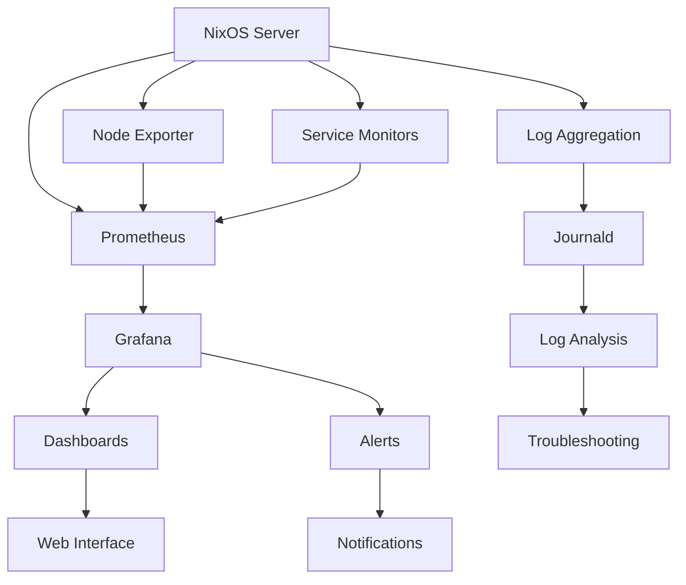

# Monitoring and Maintenance Guide

This document provides comprehensive procedures for monitoring system health and performing regular maintenance tasks on the NixOS home server.

## Monitoring Overview

The monitoring system provides comprehensive visibility into:

- **System Performance**: CPU, memory, disk, and network usage
- **Service Health**: Status and performance of all services
- **Security Events**: Failed login attempts, firewall blocks
- **Application Metrics**: Development tools and web services
- **Infrastructure Health**: Hardware status and system logs

## Monitoring Architecture



## System Monitoring Setup

### Prometheus Configuration

Prometheus collects metrics from various sources:

```nix
# nixos/services/monitoring.nix
services.prometheus = {
  enable = true;
  port = 9090;
  
  scrapeConfigs = [
    {
      job_name = "node";
      static_configs = [{
        targets = [ "localhost:9100" ];
      }];
    }
    {
      job_name = "nginx";
      static_configs = [{
        targets = [ "localhost:9113" ];
      }];
    }
    {
      job_name = "postgres";
      static_configs = [{
        targets = [ "localhost:9187" ];
      }];
    }
  ];
  
  rules = [
    ''
      groups:
      - name: system_alerts
        rules:
        - alert: HighCPUUsage
          expr: 100 - (avg by(instance) (rate(node_cpu_seconds_total{mode="idle"}[5m])) * 100) > 80
          for: 5m
          labels:
            severity: warning
          annotations:
            summary: "High CPU usage detected"
            
        - alert: HighMemoryUsage
          expr: (node_memory_MemTotal_bytes - node_memory_MemAvailable_bytes) / node_memory_MemTotal_bytes * 100 > 85
          for: 5m
          labels:
            severity: warning
          annotations:
            summary: "High memory usage detected"
            
        - alert: DiskSpaceLow
          expr: (node_filesystem_avail_bytes / node_filesystem_size_bytes) * 100 < 10
          for: 5m
          labels:
            severity: critical
          annotations:
            summary: "Disk space is running low"
    ''
  ];
};
```

### Node Exporter Configuration

```nix
services.prometheus.exporters.node = {
  enable = true;
  port = 9100;
  enabledCollectors = [
    "systemd"
    "processes"
    "interrupts"
    "ksmd"
    "logind"
    "meminfo_numa"
    "mountstats"
    "network_route"
    "systemd"
    "tcpstat"
  ];
};
```

### Grafana Setup

```nix
services.grafana = {
  enable = true;
  settings = {
    server = {
      http_addr = "0.0.0.0";
      http_port = 3000;
      domain = "nixos.local";
    };
    
    security = {
      admin_user = "admin";
      admin_password = "admin";  # Change in production
    };
    
    database = {
      type = "sqlite3";
      path = "/var/lib/grafana/grafana.db";
    };
  };
  
  provision = {
    enable = true;
    datasources.settings.datasources = [{
      name = "Prometheus";
      type = "prometheus";
      url = "http://localhost:9090";
      isDefault = true;
    }];
  };
};
```

## Monitoring Dashboards

### System Overview Dashboard

Access Grafana at `http://nixos-server:3000` and create dashboards for:

#### 1. System Performance Dashboard

**Panels to include:**
- CPU Usage (overall and per-core)
- Memory Usage (used, available, cached)
- Disk Usage (space and I/O)
- Network Traffic (in/out)
- Load Average
- System Uptime

**Sample Queries:**
```promql
# CPU Usage
100 - (avg by(instance) (rate(node_cpu_seconds_total{mode="idle"}[5m])) * 100)

# Memory Usage
(node_memory_MemTotal_bytes - node_memory_MemAvailable_bytes) / node_memory_MemTotal_bytes * 100

# Disk Usage
(node_filesystem_size_bytes - node_filesystem_avail_bytes) / node_filesystem_size_bytes * 100

# Network Traffic
rate(node_network_receive_bytes_total[5m])
rate(node_network_transmit_bytes_total[5m])
```

#### 2. Service Health Dashboard

**Panels to include:**
- Service Status (systemd units)
- HTTP Response Times
- Database Connections
- Container Status
- Process Count

**Sample Queries:**
```promql
# Service Status
node_systemd_unit_state{state="active"}

# HTTP Response Time
nginx_http_request_duration_seconds

# Database Connections
postgres_stat_database_numbackends

# Process Count
node_processes_state
```

### Application-Specific Dashboards

#### Development Environment Dashboard

Monitor development tools and services:

```promql
# Docker Container Status
container_last_seen

# Git Repository Activity
git_commits_total

# Build Success Rate
build_success_rate

# Development Server Uptime
up{job="dev_servers"}
```

#### Web Services Dashboard

Monitor web server and database performance:

```promql
# Nginx Requests
rate(nginx_http_requests_total[5m])

# Response Codes
nginx_http_requests_total

# SSL Certificate Expiry
ssl_cert_not_after - time()

# Database Query Performance
postgres_stat_statements_mean_time_ms
```

## Log Management

### Centralized Logging with Journald

```nix
# Configure persistent logging
services.journald.extraConfig = ''
  Storage=persistent
  MaxRetentionSec=30d
  MaxFileSec=1week
  SystemMaxUse=1G
  SystemMaxFileSize=100M
'';
```

### Log Analysis Commands

```bash
# View system logs
journalctl -f

# Service-specific logs
journalctl -u nginx -f
journalctl -u postgresql -f
journalctl -u sshd -f

# Filter by time
journalctl --since "1 hour ago"
journalctl --since "2024-01-20 10:00:00"

# Filter by priority
journalctl -p err
journalctl -p warning

# Search logs
journalctl -g "error"
journalctl -g "failed"

# Export logs
journalctl --since "24 hours ago" > system-logs.txt
```

### Log Monitoring Scripts

```bash
# Create log monitoring script
cat > /usr/local/bin/monitor-logs.sh << 'EOF'
#!/bin/bash

# Monitor for critical errors
journalctl --since "5 minutes ago" -p err --no-pager | \
while read line; do
  echo "CRITICAL ERROR: $line" | mail -s "System Alert" admin@example.com
done

# Monitor failed services
systemctl --failed --no-legend | \
while read service; do
  echo "FAILED SERVICE: $service" | mail -s "Service Alert" admin@example.com
done

# Monitor disk space
df -h | awk '$5 > 85 {print "DISK SPACE WARNING: " $0}' | \
while read line; do
  echo "$line" | mail -s "Disk Space Alert" admin@example.com
done
EOF

chmod +x /usr/local/bin/monitor-logs.sh
```

## Performance Monitoring

### Real-time System Monitoring

```bash
# System resource usage
htop          # Interactive process viewer
btop          # Modern system monitor
glances       # Comprehensive system monitor

# Network monitoring
nethogs       # Network usage by process
iotop         # I/O usage by process
nload         # Network traffic visualization

# Disk monitoring
ncdu /        # Disk usage analyzer
iotop         # Disk I/O monitoring
smartctl -a /dev/sda  # Hard drive health
```

### Performance Metrics Collection

```bash
# CPU performance
mpstat 1 10   # CPU statistics
sar -u 1 10   # CPU utilization

# Memory performance
free -h       # Memory usage
vmstat 1 10   # Virtual memory statistics

# Disk performance
iostat -x 1 10  # I/O statistics
iotop -a        # I/O usage by process

# Network performance
ss -tuln        # Network connections
netstat -i      # Network interface statistics
```

### Custom Monitoring Scripts

```bash
# System health check script
cat > /usr/local/bin/health-check.sh << 'EOF'
#!/bin/bash

echo "=== System Health Check - $(date) ==="

# Check system load
load=$(uptime | awk -F'load average:' '{print $2}' | awk '{print $1}' | sed 's/,//')
if (( $(echo "$load > 2.0" | bc -l) )); then
  echo "WARNING: High system load: $load"
fi

# Check memory usage
mem_usage=$(free | awk '/^Mem:/{printf "%.1f", $3/$2 * 100}')
if (( $(echo "$mem_usage > 85" | bc -l) )); then
  echo "WARNING: High memory usage: ${mem_usage}%"
fi

# Check disk space
df -h | awk '$5 > 85 {print "WARNING: High disk usage on " $6 ": " $5}'

# Check failed services
failed_services=$(systemctl --failed --no-legend | wc -l)
if [ $failed_services -gt 0 ]; then
  echo "WARNING: $failed_services failed services"
  systemctl --failed --no-legend
fi

# Check network connectivity
if ! ping -c 1 8.8.8.8 > /dev/null 2>&1; then
  echo "ERROR: No internet connectivity"
fi

echo "=== Health Check Complete ==="
EOF

chmod +x /usr/local/bin/health-check.sh
```

## Maintenance Procedures

### Daily Maintenance Tasks

```bash
# Automated daily maintenance
cat > /usr/local/bin/daily-maintenance.sh << 'EOF'
#!/bin/bash

echo "Starting daily maintenance - $(date)"

# Update system packages
nix flake update
nixos-rebuild switch --flake .

# Clean old generations
nix-collect-garbage -d

# Check system health
/usr/local/bin/health-check.sh

# Rotate logs
journalctl --vacuum-time=30d

# Check backup status
systemctl status backup-to-mac.service

# Update SSL certificates
certbot renew --quiet

echo "Daily maintenance complete - $(date)"
EOF

chmod +x /usr/local/bin/daily-maintenance.sh
```

### Weekly Maintenance Tasks

```bash
# Weekly maintenance script
cat > /usr/local/bin/weekly-maintenance.sh << 'EOF'
#!/bin/bash

echo "Starting weekly maintenance - $(date)"

# Deep system cleanup
nix-store --gc
nix-store --optimize

# Check filesystem integrity
fsck -n /dev/sda1

# Update security tools
freshclam  # Update ClamAV definitions
rkhunter --update  # Update rootkit hunter

# Generate system report
/usr/local/bin/system-report.sh > /var/log/weekly-report-$(date +%Y%m%d).txt

# Test backup restore
/usr/local/bin/test-backup-restore.sh

echo "Weekly maintenance complete - $(date)"
EOF

chmod +x /usr/local/bin/weekly-maintenance.sh
```

### Monthly Maintenance Tasks

```bash
# Monthly maintenance script
cat > /usr/local/bin/monthly-maintenance.sh << 'EOF'
#!/bin/bash

echo "Starting monthly maintenance - $(date)"

# Security audit
lynis audit system --quiet
rkhunter --check --skip-keypress

# Performance analysis
sar -A > /var/log/performance-$(date +%Y%m).txt

# Disk health check
smartctl -t long /dev/sda

# Network security scan
nmap -sS localhost

# Update documentation
git -C /etc/nixos add .
git -C /etc/nixos commit -m "Monthly maintenance update - $(date)"

echo "Monthly maintenance complete - $(date)"
EOF

chmod +x /usr/local/bin/monthly-maintenance.sh
```

### Maintenance Scheduling

```nix
# Schedule maintenance tasks
systemd.services.daily-maintenance = {
  description = "Daily system maintenance";
  serviceConfig = {
    Type = "oneshot";
    ExecStart = "/usr/local/bin/daily-maintenance.sh";
  };
};

systemd.timers.daily-maintenance = {
  description = "Run daily maintenance";
  wantedBy = [ "timers.target" ];
  timerConfig = {
    OnCalendar = "03:00";
    Persistent = true;
  };
};

systemd.services.weekly-maintenance = {
  description = "Weekly system maintenance";
  serviceConfig = {
    Type = "oneshot";
    ExecStart = "/usr/local/bin/weekly-maintenance.sh";
  };
};

systemd.timers.weekly-maintenance = {
  description = "Run weekly maintenance";
  wantedBy = [ "timers.target" ];
  timerConfig = {
    OnCalendar = "Sun 04:00";
    Persistent = true;
  };
};
```

## Security Monitoring

### Intrusion Detection

```bash
# Monitor failed login attempts
journalctl -u sshd | grep "Failed password" | tail -20

# Check for suspicious network activity
netstat -an | grep LISTEN
ss -tuln

# Monitor file system changes
find /etc -type f -mtime -1 -ls
find /usr/local/bin -type f -mtime -1 -ls

# Check for rootkits
rkhunter --check --report-warnings-only
chkrootkit
```

### Security Alerts

```bash
# Set up security monitoring
cat > /usr/local/bin/security-monitor.sh << 'EOF'
#!/bin/bash

# Monitor SSH brute force attempts
ssh_failures=$(journalctl --since "1 hour ago" -u sshd | grep "Failed password" | wc -l)
if [ $ssh_failures -gt 10 ]; then
  echo "SECURITY ALERT: $ssh_failures SSH login failures in the last hour" | \
    mail -s "SSH Brute Force Alert" admin@example.com
fi

# Monitor sudo usage
sudo_usage=$(journalctl --since "1 hour ago" | grep "sudo:" | wc -l)
if [ $sudo_usage -gt 20 ]; then
  echo "SECURITY ALERT: Unusual sudo activity detected" | \
    mail -s "Sudo Activity Alert" admin@example.com
fi

# Check for new processes
ps aux --sort=-%cpu | head -20 > /tmp/current_processes
if [ -f /tmp/previous_processes ]; then
  diff /tmp/previous_processes /tmp/current_processes | \
    grep "^>" | mail -s "New Process Alert" admin@example.com
fi
mv /tmp/current_processes /tmp/previous_processes
EOF

chmod +x /usr/local/bin/security-monitor.sh
```

## Alerting and Notifications

### Email Notifications

```nix
# Configure email notifications
services.postfix = {
  enable = true;
  setSendmail = true;
  relayHost = "smtp.gmail.com";
  relayPort = 587;
  config = {
    smtp_use_tls = "yes";
    smtp_sasl_auth_enable = "yes";
    smtp_sasl_password_maps = "hash:/etc/postfix/sasl_passwd";
  };
};
```

### Slack Notifications

```bash
# Slack webhook notification function
send_slack_alert() {
  local message="$1"
  local webhook_url="YOUR_SLACK_WEBHOOK_URL"
  
  curl -X POST -H 'Content-type: application/json' \
    --data "{\"text\":\"$message\"}" \
    "$webhook_url"
}

# Use in monitoring scripts
if [ $cpu_usage -gt 80 ]; then
  send_slack_alert "High CPU usage detected: ${cpu_usage}%"
fi
```

### Dashboard Alerts

Configure Grafana alerts for critical metrics:

```json
{
  "alert": {
    "conditions": [
      {
        "query": {
          "queryType": "",
          "refId": "A"
        },
        "reducer": {
          "type": "last",
          "params": []
        },
        "evaluator": {
          "params": [80],
          "type": "gt"
        }
      }
    ],
    "executionErrorState": "alerting",
    "for": "5m",
    "frequency": "10s",
    "handler": 1,
    "name": "High CPU Usage",
    "noDataState": "no_data",
    "notifications": []
  }
}
```

## Troubleshooting Monitoring Issues

### Common Monitoring Problems

#### 1. Prometheus Not Collecting Metrics

```bash
# Check Prometheus status
systemctl status prometheus

# Verify configuration
promtool check config /etc/prometheus/prometheus.yml

# Check targets
curl http://localhost:9090/api/v1/targets

# Restart Prometheus
systemctl restart prometheus
```

#### 2. Grafana Dashboard Issues

```bash
# Check Grafana logs
journalctl -u grafana -f

# Verify database
sqlite3 /var/lib/grafana/grafana.db ".tables"

# Reset admin password
grafana-cli admin reset-admin-password newpassword
```

#### 3. Node Exporter Problems

```bash
# Check Node Exporter status
systemctl status prometheus-node-exporter

# Test metrics endpoint
curl http://localhost:9100/metrics

# Check firewall
iptables -L | grep 9100
```

### Performance Troubleshooting

```bash
# Identify performance bottlenecks
# CPU bottlenecks
top -o %CPU
ps aux --sort=-%cpu | head -10

# Memory bottlenecks
ps aux --sort=-%mem | head -10
cat /proc/meminfo

# Disk I/O bottlenecks
iotop -a
iostat -x 1 5

# Network bottlenecks
iftop
nethogs
```

This comprehensive monitoring and maintenance guide ensures optimal performance and reliability of the NixOS home server through proactive monitoring, regular maintenance, and effective troubleshooting procedures.